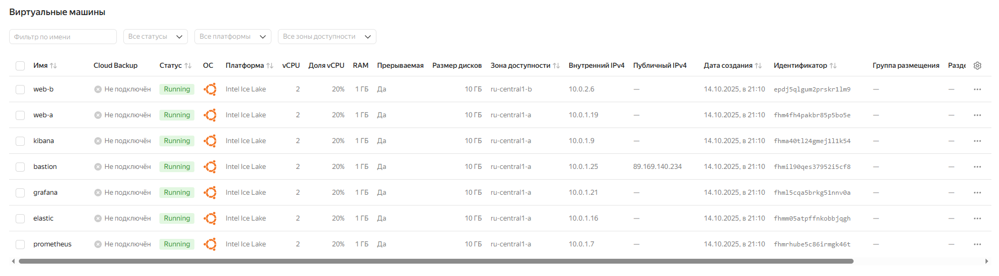
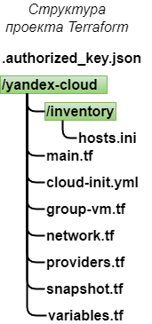
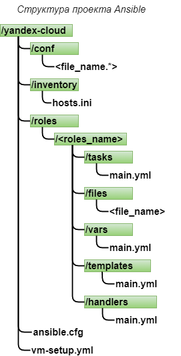

# Курсовая работа на профессии "DevOps-инженер с нуля"

## Содержание
* [Задача](#Задача)
* [Инфраструктура](#Инфраструктура)
    * [Сайт](#Сайт)
    * [Мониторинг](#Мониторинг)
    * [Логи](#Логи)
    * [Сеть](#Сеть)
    * [Резервное копирование](#Резервное-копирование)
    * [Дополнительно](#Дополнительно)
* [Выполнение работы](#Выполнение-работы)
* [Критерии сдачи](#Критерии-сдачи)
* [Как правильно задавать вопросы дипломному руководителю](#Как-правильно-задавать-вопросы-дипломному-руководителю) 

## Задача
Ключевая задача — разработать отказоустойчивую инфраструктуру для сайта, включающую мониторинг, сбор логов и резервное копирование основных данных. Инфраструктура должна размещаться в [Yandex Cloud](https://cloud.yandex.com/).

**Примечание**: в курсовой работе используется система мониторинга Prometheus. Вместо Prometheus вы можете использовать Zabbix. Задание для курсовой работы с использованием Zabbix находится по [ссылке](https://github.com/netology-code/fops-sysadm-diplom/blob/diplom-zabbix/README.md).

**Перед началом работы над дипломным заданием изучите [Инструкция по экономии облачных ресурсов](https://github.com/netology-code/devops-materials/blob/master/cloudwork.MD).**   

## Инфраструктура
Для развёртки инфраструктуры используйте Terraform и Ansible. 

Параметры виртуальной машины (ВМ) подбирайте по потребностям сервисов, которые будут на ней работать. 

Ознакомьтесь со всеми пунктами из этой секции, не беритесь сразу выполнять задание, не дочитав до конца. Пункты взаимосвязаны и могут влиять друг на друга.

### Сайт
Создайте две ВМ в разных зонах, установите на них сервер nginx, если его там нет. ОС и содержимое ВМ должно быть идентичным, это будут наши веб-сервера.

Используйте набор статичных файлов для сайта. Можно переиспользовать сайт из домашнего задания.

Создайте [Target Group](https://cloud.yandex.com/docs/application-load-balancer/concepts/target-group), включите в неё две созданных ВМ.

Создайте [Backend Group](https://cloud.yandex.com/docs/application-load-balancer/concepts/backend-group), настройте backends на target group, ранее созданную. Настройте healthcheck на корень (/) и порт 80, протокол HTTP.

Создайте [HTTP router](https://cloud.yandex.com/docs/application-load-balancer/concepts/http-router). Путь укажите — /, backend group — созданную ранее.

Создайте [Application load balancer](https://cloud.yandex.com/en/docs/application-load-balancer/) для распределения трафика на веб-сервера, созданные ранее. Укажите HTTP router, созданный ранее, задайте listener тип auto, порт 80.

Протестируйте сайт
`curl -v <публичный IP балансера>:80` 

### Мониторинг
Создайте ВМ, разверните на ней Prometheus. На каждую ВМ из веб-серверов установите Node Exporter и [Nginx Log Exporter](https://github.com/martin-helmich/prometheus-nginxlog-exporter). Настройте Prometheus на сбор метрик с этих exporter.

Создайте ВМ, установите туда Grafana. Настройте её на взаимодействие с ранее развернутым Prometheus. Настройте дешборды с отображением метрик, минимальный набор — Utilization, Saturation, Errors для CPU, RAM, диски, сеть, http_response_count_total, http_response_size_bytes. Добавьте необходимые [tresholds](https://grafana.com/docs/grafana/latest/panels/thresholds/) на соответствующие графики.

### Логи
Cоздайте ВМ, разверните на ней Elasticsearch. Установите filebeat в ВМ к веб-серверам, настройте на отправку access.log, error.log nginx в Elasticsearch.

Создайте ВМ, разверните на ней Kibana, сконфигурируйте соединение с Elasticsearch.

### Сеть
Разверните один VPC. Сервера web, Prometheus, Elasticsearch поместите в приватные подсети. Сервера Grafana, Kibana, application load balancer определите в публичную подсеть.

Настройте [Security Groups](https://cloud.yandex.com/docs/vpc/concepts/security-groups) соответствующих сервисов на входящий трафик только к нужным портам.

Настройте ВМ с публичным адресом, в которой будет открыт только один порт — ssh. Настройте все security groups на разрешение входящего ssh из этой security group. Эта вм будет реализовывать концепцию bastion host. Потом можно будет подключаться по ssh ко всем хостам через этот хост.

### Резервное копирование
Создайте snapshot дисков всех ВМ. Ограничьте время жизни snaphot в неделю. Сами snaphot настройте на ежедневное копирование.

### Дополнительно
Не входит в минимальные требования. 

1. Для Prometheus можно реализовать альтернативный способ хранения данных — в базе данных PpostgreSQL. Используйте [Yandex Managed Service for PostgreSQL](https://cloud.yandex.com/en-ru/services/managed-postgresql). Разверните кластер из двух нод с автоматическим failover. Воспользуйтесь адаптером с https://github.com/CrunchyData/postgresql-prometheus-adapter для настройки отправки данных из Prometheus в новую БД.
2. Вместо конкретных ВМ, которые входят в target group, можно создать [Instance Group](https://cloud.yandex.com/en/docs/compute/concepts/instance-groups/), для которой настройте следующие правила автоматического горизонтального масштабирования: минимальное количество ВМ на зону — 1, максимальный размер группы — 3.
3. Можно добавить в Grafana оповещения с помощью Grafana alerts. Как вариант, можно также установить Alertmanager в ВМ к Prometheus, настроить оповещения через него.
4. В Elasticsearch добавьте мониторинг логов самого себя, Kibana, Prometheus, Grafana через filebeat. Можно использовать logstash тоже.
5. Воспользуйтесь Yandex Certificate Manager, выпустите сертификат для сайта, если есть доменное имя. Перенастройте работу балансера на HTTPS, при этом нацелен он будет на HTTP веб-серверов.

## Выполнение работы
На этом этапе вы непосредственно выполняете работу. При этом вы можете консультироваться с руководителем по поводу вопросов, требующих уточнения.

⚠️ В случае недоступности ресурсов Elastic для скачивания рекомендуется разворачивать сервисы с помощью docker контейнеров, основанных на официальных образах.

**Важно**: Ещё можно задавать вопросы по поводу того, как реализовать ту или иную функциональность. И руководитель определяет, правильно вы её реализовали или нет. Любые вопросы, которые не освещены в этом документе, стоит уточнять у руководителя. Если его требования и указания расходятся с указанными в этом документе, то приоритетны требования и указания руководителя.

## Критерии сдачи
1. Инфраструктура отвечает минимальным требованиям, описанным в [Задаче](#Задача).
2. Предоставлен доступ ко всем ресурсам, у которых предполагается веб-страница (сайт, Kibana, Grafanа).
3. Для ресурсов, к которым предоставить доступ проблематично, предоставлены скриншоты, команды, stdout, stderr, подтверждающие работу ресурса.
4. Работа оформлена в отдельном репозитории в GitHub или в [Google Docs](https://docs.google.com/), разрешён доступ по ссылке. 
5. Код размещён в репозитории в GitHub.
6. Работа оформлена так, чтобы были понятны ваши решения и компромиссы. 
7. Если использованы дополнительные репозитории, доступ к ним открыт. 

## Как правильно задавать вопросы дипломному руководителю
Что поможет решить большинство частых проблем:
1. Попробовать найти ответ сначала самостоятельно в интернете или в материалах курса и только после этого спрашивать у дипломного руководителя. Навык поиска ответов пригодится вам в профессиональной деятельности.
2. Если вопросов больше одного, присылайте их в виде нумерованного списка. Так дипломному руководителю будет проще отвечать на каждый из них.
3. При необходимости прикрепите к вопросу скриншоты и стрелочкой покажите, где не получается. Программу для этого можно скачать [здесь](https://app.prntscr.com/ru/).

Что может стать источником проблем:
1. Вопросы вида «Ничего не работает. Не запускается. Всё сломалось». Дипломный руководитель не сможет ответить на такой вопрос без дополнительных уточнений. Цените своё время и время других.
2. Откладывание выполнения дипломной работы на последний момент.
3. Ожидание моментального ответа на свой вопрос. Дипломные руководители — работающие инженеры, которые занимаются, кроме преподавания, своими проектами. Их время ограничено, поэтому постарайтесь задавать правильные вопросы, чтобы получать быстрые ответы :)


## Содержание по выполнению курсового проекта:
* ## [Введение](#Введение)
* ## [Описание инфраструктуры](#Описание-инфраструктуры)
* ## [Развёртывание и настройка инфраструктуры](#Развёртывание-и-настройка-инфраструктуры)
* ## [Результаты](#Результаты)
* ## [Заключение](#Заключение)


## Введение

Современные веб-системы предъявляют высокие требования к доступности, надёжности и безопасности информационной инфраструктуры.
Для обеспечения бесперебойной работы сервисов необходимо проектировать отказоустойчивые решения, предусматривающие балансировку
нагрузки, централизованный сбор логов, мониторинг состояния компонентов и регулярное резервное копирование данных.
Целью данной курсовой работы является разработка и внедрение отказоустойчивой инфраструктуры для веб-сайта с использованием облачной платформы Yandex Cloud.

В рамках работы реализована инфраструктура, обеспечивающая:
* размещение сайта на двух веб-серверах с балансировкой нагрузки;
* сбор метрик и мониторинг состояния сервисов с помощью Prometheus и Grafana;
* централизованный сбор логов через Filebeat, Elasticsearch и Kibana;
* организацию защищённой сетевой архитектуры с использованием VPC, подсетей и Security Groups;
* настройку резервного копирования путём автоматического создания snapshot-ов дисков виртуальных машин.

Для автоматизации развёртывания инфраструктуры использованы инструменты Terraform и Ansible, что обеспечивает воспроизводимость и масштабируемость решения.
Разработанная инфраструктура демонстрирует принципы Infrastructure as Code (IaC) и соответствует современным требованиям к построению надёжных облачных систем.

## Описание инфраструктуры

Разработанная инфраструктура размещена в облачной платформе Yandex Cloud и построена по принципу отказоустойчивости, разделения ролей и безопасности. Основу решения составляют виртуальные машины (ВМ), объединённые в единую виртуальную сеть (VPC) с выделением публичных и приватных подсетей.


### Общая структура

Инфраструктура включает следующие основные компоненты:



1. **Bastion host** — ВМ с публичным IP-адресом, через которую осуществляется доступ по SSH ко всем остальным узлам. На уровне сетевой безопасности реализована концепция «единой точки входа», что исключает прямой доступ к внутренним серверам из интернета.

2. **Веб-сервера (web_a, web_b)** — два идентичных узла, размещённые в разных зонах доступности для повышения отказоустойчивости. На серверах установлен nginx, обслуживающий статический веб-сайт.

3. **Application Load Balancer (ALB)** — балансировщик, распределяющий входящий HTTP-трафик между веб-серверами. Реализована проверка доступности (healthcheck) по протоколу HTTP на корневой путь /.

4. **Система мониторинга:**
* **Prometheus** — собирает метрики со всех веб-серверов и инфраструктурных компонентов (через Node Exporter);
* **Grafana** — визуализирует данные из Prometheus и предоставляет дашборды по состоянию системы, нагрузке и ошибкам.

5. **Система логирования (ELK-стек):**
* **Elasticsearch** — хранение и индексация логов;
* **Filebeat** — установлен на веб-серверах и отвечает за передачу access.log и error.log nginx в Elasticsearch;
* **Kibana** — предоставляет интерфейс для анализа логов и построения визуальных отчётов.

6. **Резервное копирование** — для всех виртуальных машин автоматически создаются snapshot-ы дисков. Снимки формируются ежедневно, срок хранения — 7 дней. Данная политика реализована средствами Terraform.

### Сетевая организация
* **Публичная подсеть** — включает bastion host, Grafana, Kibana и Application Load Balancer.
* **Приватная подсеть** — размещает веб-сервера, Prometheus и Elasticsearch, доступ к которым осуществляется только через bastion host.

Для управления доступом используются Security Groups, которые ограничивают входящие соединения только нужными портами (например, 22/tcp для SSH, 80/tcp для HTTP, 3000/tcp для Grafana, 9200/tcp для Elasticsearch).

### Автоматизация

Развёртывание инфраструктуры выполнено с помощью:
* **Terraform** — создание всех облачных ресурсов: виртуальных машин, сетей, подсетей, балансировщика нагрузки, групп безопасности и snapshot-политики;
* **Ansible** — установка и настройка программных компонентов (nginx, Prometheus, Grafana, Elasticsearch, Kibana, Filebeat).

Использование этих инструментов обеспечивает воспроизводимость и удобное управление конфигурацией инфраструктуры в соответствии с принципом **Infrastructure as Code (IaC)**.

### Развёртывание и настройка инфраструктуры

Развёртывание инфраструктуры выполнялось в два этапа с использованием инструментов Terraform и Ansible, что соответствует современному подходу Infrastructure as Code (IaC). Такой подход обеспечивает воспроизводимость среды, автоматизацию и возможность быстрого восстановления инфраструктуры при необходимости.

1. ### Развёртывание с помощью Terraform



Для автоматического создания облачных ресурсов использовался Terraform с провайдером **Yandex.Cloud**.
Все конфигурационные файлы (.tf) разделены по логическим блокам:
* **main.tf** — основные ресурсы (виртуальные машины, подсети, балансировщик нагрузки);
* **cloud-init.yml** - публичный ключ и учетные данные для доступа к виртуальным машинам;
* **network.tf** — определение сети (VPC, подсети, маршруты);
* **group-vm.tf** — определение  security groups;
* **providers.tf** - настройки провайдера Terraform;
* **snapshots.tf** — создание snapshot-политики для резервного копирования дисков;
* **variables.tf** — описание переменных и их значений;
* **hosts.ini** — вывод основных параметров инфраструктуры (IP-адреса, URL сервисов) для дальнейшей автоматизации в Ansible.

**ВИМАНИЕ:** Для достпа Terraform к аккаунту Yandex Cloud, обязательно должен быть добавлен ключ доступа в домашнюю **~/.authorized_key.json**

После подготовки конфигурации инфраструктура создавалась командами:
```bash
terraform init
terraform plan
terraform apply
terraform destroy
```

Terraform автоматически создаёт:
* виртуальные машины (bastion, web_a, web_b, prometheus, grafana, elasticsearch, kibana);
* подсети в разных зонах доступности;
* балансировщик нагрузки (Application Load Balancer);
* правила безопасности (Security Groups);
* ежедневные snapshot’ы дисков с хранением в течение 7 дней.

Использование **allow_stopping_for_update = true** позволяет безопасно изменять конфигурацию ВМ без удаления и пересоздания ресурсов.


2. ### Настройка сервисов с помощью Ansible

После развертывания виртуальных машин настройка программных компонентов выполнялась с использованием Ansible.
Для этого была разработана структура ролей, каждая из которых отвечает за установку и конфигурацию конкретного сервиса:

* **timezone** - настройка часового пояса виртуальных машин
* **bastion** — настройка SSH-доступа и системных обновлений;
* **node-exporter** - установка инастройка сборщика метрик виртуальных машин;
* **nginx** — установка веб-сервера, размещение статического сайта и настройка конфигурации;
* **prometheus** — установка и настройка системы мониторинга;
* **grafana** — установка панели визуализации и настройка подключения к Prometheus;
* **elastic** — установка и конфигурация Elasticsearch;
* **kibana** — настройка интерфейса визуализации логов и подключение к Elasticsearch;
* **filebeat** — установка агента сбора логов на веб-сервера и настройка передачи данных в Elasticsearch;

Каждая роль содержит:
* **tasks/** — основную логику установки и настройки сервисов;
* **templates/** и **files/** — шаблоны конфигурационных файлов и статический контент;
* **handlers/** — действия, выполняемые при изменении конфигурации (например, перезапуск nginx или prometheus).



Выполнение всех ролей осуществляется главным плейбуком **vm-setup.yml**.

Запуск плейбука выполняется командой:

```bash
ANSIBLE_HOST_KEY_CHECKING=False ansible-playbook -i ./inventory/hosts.ini vm-setup.yml
```
Для доступа к виртуальным машинам должен быть обязательно сгенирированы приватный и публичный ключи.
Публичный ключ должен находиться в файле **cloud-init.yml**. Именно через него осуществляется доступ к виртуальным машинам всей инфраструктуры.
Переименуйте файл **cloud-init-template.yml** в **cloud-init.yml** и замените поле **<ssh_key_public>** на свой сгенирированный публичный ключ.

Иногда требуется очистка кэша о старых ключах:

```bash
rm ~/.ssh/known_hosts
```


В процессе настройки также задаются:
* часовой пояс (Europe/Moscow);
* системные параметры (включение автозагрузки сервисов);
* конфигурации безопасности и прав доступа.

3. ### Проверка и тестирование

После выполнения Terraform и Ansible были проведены проверки:
* доступность сайта через **Application Load Balancer**;
* сбор метрик **Prometheus** и их отображение в **Grafana**;
* доставка логов в **Elasticsearch** и их визуализация в **Kibana**;
* корректность **snapshot-политики** и создание резервных копий.

Подключиться к виртуальным машинам через консоль можно командой:
```bash
ssh -J user@<ip_bastion> user@<ip_vm или hostname_vm>
```
**ip_bastion**,**ip_vm** - адреса можно взять из сформированного файла **host.ini** в папке **inventory** после создания инфраструктуры Terraform.


### Результаты

В результате выполненной работы была развернута и настроена отказоустойчивая инфраструктура веб-приложения в облачной платформе **Yandex Cloud** с использованием технологий **Terraform** и **Ansible**.

Основные достигнутые результаты:

1. ### Развернута облачная инфраструктура:
* создана **виртуальная частная сеть** (VPC) с публичными и приватными подсетями в разных зонах доступности;
* настроены **группы безопасности** (Security Groups), обеспечивающие доступ только к необходимым портам;
* реализована концепция **bastion host** для безопасного SSH-доступа ко всем внутренним узлам.

2. ### Обеспечена отказоустойчивость веб-приложения:
* развернуты два идентичных **веб-сервера с** **Nginx** в разных зонах;
* создан **Application Load Balancer**, распределяющий входящий HTTP-трафик между серверами;
* размещен **статический сайт**, доступный через балансировщик по порту 80.

3. ### Настроена система мониторинга:
* развернут **Prometheus** для сбора метрик с веб-серверов через **Node Exporter**;
* установлена **Grafana** для визуализации данных;
* настроены **дашборды**, отображающие ключевые показатели (**CPU, RAM, дисковая активность, сеть, HTTP-ответы**).

4. ### Реализована система централизованного логирования:
* развернут **Elasticsearch** для хранения логов;
* установлен **Kibana** для визуализации логов;
* **Filebeat** на веб-серверах настроен на отправку **access.log** и **error.log** в **Elasticsearch**.

5. ### Настроено резервное копирование:
* реализовано **создание snapshot-ов** дисков всех ВМ с помощью **Terraform**;
* установлен срок хранения резервных копий — **7 дней**;
* настроено **ежедневное** автоматическое создание snapshot-ов.

6. ### Проведенные тесты показали:
* корректное распределение трафика балансировщиком;
* доступность всех сервисов через настроенные Security Groups;
* успешную отправку и визуализацию метрик и логов;
* регулярное создание snapshot-ов.

Таким образом, все поставленные задачи были выполнены в полном объеме, а разработанная инфраструктура отвечает требованиям по отказоустойчивости, безопасности и наблюдаемости.

### Заключение

В ходе выполнения курсовой работы была спроектирована, реализована и протестирована облачная инфраструктура для веб-приложения с использованием сервисов **Yandex Cloud**.
Проект продемонстрировал практическое применение принципов **DevOps** и технологий **Infrastructure as Code**, обеспечив:
* автоматизированное развертывание инфраструктуры с помощью **Terraform**;
* централизованную настройку и управление конфигурацией через **Ansible**;
* мониторинг и визуализацию состояния системы;
* сбор и анализ логов;
* регулярное резервное копирование данных.

Результатом работы является готовая к эксплуатации инфраструктура, которая:
* легко масштабируется;
* устойчива к сбоям;
* имеет централизованное управление и мониторинг;
* соответствует требованиям по отказоустойчивости и безопасности.

В дальнейшем проект может быть расширен за счет:
* интеграции с CI/CD-системой (например, GitLab CI или Jenkins);
* добавления HTTPS с использованием Let’s Encrypt;
* внедрения alert-системы на базе Alertmanager или Telegram-бота;
* оптимизации расходов на облачные ресурсы.

Таким образом, поставленные цели были достигнуты, а курсовая работа продемонстрировала навыки проектирования, автоматизации и эксплуатации облачных инфраструктур с использованием современных инструментов **DevOps**.